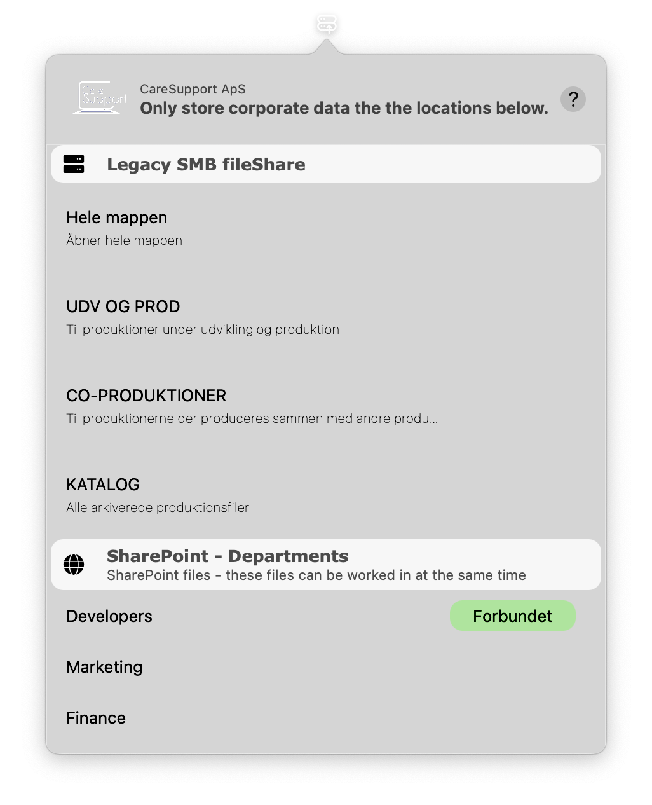

# ServerConnect

## Introduction
ServerConnect is an open-source menubar macOS application written in Swift. It is designed for IT Managers to deploy and configure using an MDM system, allowing employees to easily access company-designated data locations. The app supports both Legacy SMB / AFP server connections and online services like SharePoint, Box or Dropbox.



## Table of Contents
- [ServerConnect](#serverconnect)
  - [Introduction](#introduction)
  - [Table of Contents](#table-of-contents)
  - [Installation](#installation)
  - [Usage](#usage)
  - [Features](#features)
  - [Dependencies](#dependencies)
  - [Configuration](#configuration)

## Installation
ServerConnect should be installed using the provided `.pkg` file. The app itself is notarized, but the `.pkg` is not, so it needs to be distributed using an MDM. 

1. Distribute the `.pkg` file via your MDM system.
2. Distribute your custom .mobileconfig using your MDM (before the next step)
3. Once deployed, the application should be launched manually or through a script. The app loads from the .mobileconfig everytime the menubar icon is pressed, however logo, companyname and subtitle is only loaded on app launch.
4. After the first launch, the application will automatically start using an inbuilt LaunchAgent.

## Usage
Once the app is configured by the admin, the user can:

1. Click on the ServerConnect icon in the menubar.
2. Select the specific path they want to access.
3. The app will then prompt the user for their SMB credentials (username and password). If user has previously saved their credentials, it will attempt to connect immediately. To override the automatic connection, hold SHIFT while pressing the path.
4. After entering the credentials, the app attempts to connect to the selected path over SMB.

For online services like SharePoint:
1. Select the SharePoint path in the menubar.
2. Open the folder in SharePoint and press sync to synchronize it with OneDrive.
3. The folder will then be directly accessible in Finder.

## Features
- **SMB Server Support**: Connect to SMB servers with user authentication.
- **SharePoint Integration**: Link to specific online folders in SharePoint and sync with OneDrive for Finder access.
- **MDM Configurable**: Easily deploy and configure using an MDM system.
- **Menubar Access**: Simple menubar interface for quick access to configured paths.

## Dependencies
ServerConnect uses the following libraries and frameworks:
- [AwesomeEnum](http://cocoapods.org/pods/AwesomeEnum)
- [LaunchAtLogin](https://github.com/sindresorhus/LaunchAtLogin)
- OpenLDAP
- SASL

## Configuration
ServerConnect can be configured using a `.mobileconfig` file provided by the admin. The configuration file allows the admin to set up all necessary paths and settings for the users. 

Example `.mobileconfig` file:
```xml
<?xml version="1.0" encoding="UTF-8"?>
<!DOCTYPE plist PUBLIC "-//Apple//DTD PLIST 1.0//EN" "http://www.apple.com/DTDs/PropertyList-1.0.dtd">
<plist version="1.0">
<dict>
    <!-- Configuration settings go here -->
</dict>
</plist>


productbuild --sign 8XW2A3LKCS --component /Users/emillind/Downloads/3.6/ServerConnect.app /Applications /Users/emillind/Downloads/3.6/ServerConnect.pkg